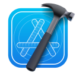
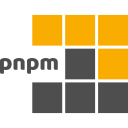

## Tech Stack

### Languages

<table>
<tr>
<td align="center" width="100"> Python</td>
<td align="center" width="100"> JavaScript</td>
<td align="center" width="100"> TypeScript</td>
<td align="center" width="100"> Swift</td>
</tr>
<tr>
<td align="center" width="100"> C#</td>
<td align="center" width="100"> Bash</td>
</tr>
</table>

### Frontend

<table>
<tr>
<td align="center" width="100"> React</td>
<td align="center" width="100"> Next.js</td>
<td align="center" width="100"> Redux</td>
<td align="center" width="100"> TailwindCSS</td>
</tr>
<tr>
<td align="center" width="100"> HTML5</td>
<td align="center" width="100"> CSS3</td>
<td align="center" width="100"> Sass</td>
<td align="center" width="100"> Less</td>
</tr>
</table>

### Mobile

<table><tr>
<td align="center" width="100"> React Native</td>
<td align="center" width="100"> Xcode</td>
<td align="center" width="100"> Expo</td>
</tr></table>

### Backend & Databases

<table>
<tr>
<td align="center" width="100"> Node.js</td>
<td align="center" width="100"> FastAPI</td>
<td align="center" width="100"> Payload</td>
<td align="center" width="100"> Directus</td>
</tr>
<tr>
<td align="center" width="100"> Postgres</td>
<td align="center" width="100"> MySQL</td>
<td align="center" width="100"> MongoDB</td>
<td align="center" width="100"> SQLite</td>
</tr>
<tr>
<td align="center" width="100"> Solr</td>
</tr>
</table>

### Infrastructure & DevOps

<table>
<tr>
<td align="center" width="100"> Linux</td>
<td align="center" width="100"> Nginx</td>
<td align="center" width="100"> Docker</td>
<td align="center" width="100"> GitLab CI/CD</td>
</tr>
<tr>
<td align="center" width="100"> GitHub Actions</td>
</tr>
</table>

### Tools

<table>
<tr>
<td align="center" width="100"> Git</td>
<td align="center" width="100"> GitHub</td>
<td align="center" width="100"> GitLab</td>
<td align="center" width="100"> VS Code</td>
</tr>
<tr>
<td align="center" width="100"> PyCharm</td>
<td align="center" width="100"> npm</td>
<td align="center" width="100"> pnpm</td>
<td align="center" width="100"> Postman</td>
</tr>
<tr>
<td align="center" width="100"> Jest</td>
<td align="center" width="100"> Playwright</td>
<td align="center" width="100"> Claude</td>
</tr>
</table>

